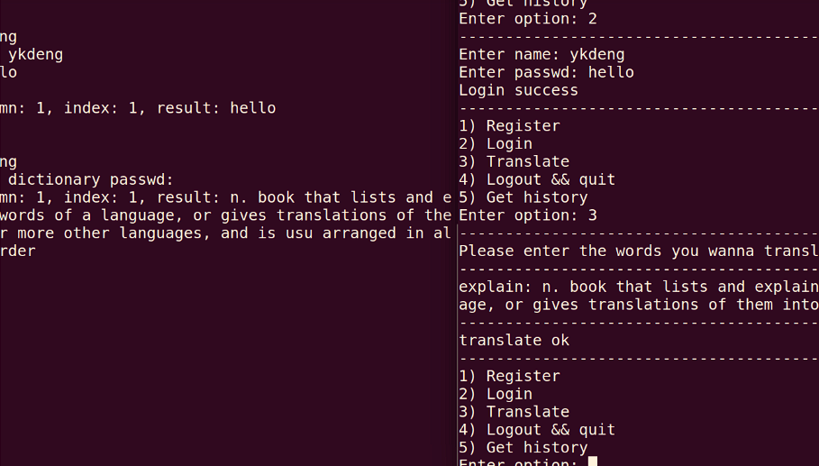

# 1. 电子词典(英译英)
## 开发环境: ubuntu16.04
## 开发语言: C
## 描述
- 利用epoll机制将监听套接字挂在epoll树上监听来自不同客户端的请求, 一旦接收到请求就将连接套接字加入树中, 根据请求的类型来进行注册, 登录, 翻译, 查询历史记录, 登出的操作。
- 使用一个结构体包(pack)存放TCP传输过程中的信息, 包中的成员name在传输的过程中不能更改, 便于客户端与服务端识别对方的姓名及保存至数据库, 也方便每次登录注册翻译时查询。
- 服务端的登录, 翻译, 查询功能可以集成在一个函数中, 把数据库和接收请求类型作为函数参数, 利用switch判断请求类型, 根据不同类型来更改char *sql的操作, 这样就能避免重复定义
## 效果图
- 
- 
---
# 2. 五子棋(Linux终端离线双人五子棋)
## 开发环境: ubuntu16.04
## 开发语言: C++
## 描述
- 终端环境下使用的离线双人五子棋游戏, 通过WSAD键来移动棋子, SPACE键来落子, 横竖左右斜方向落满五颗子则判定为胜利
## 效果图
- 